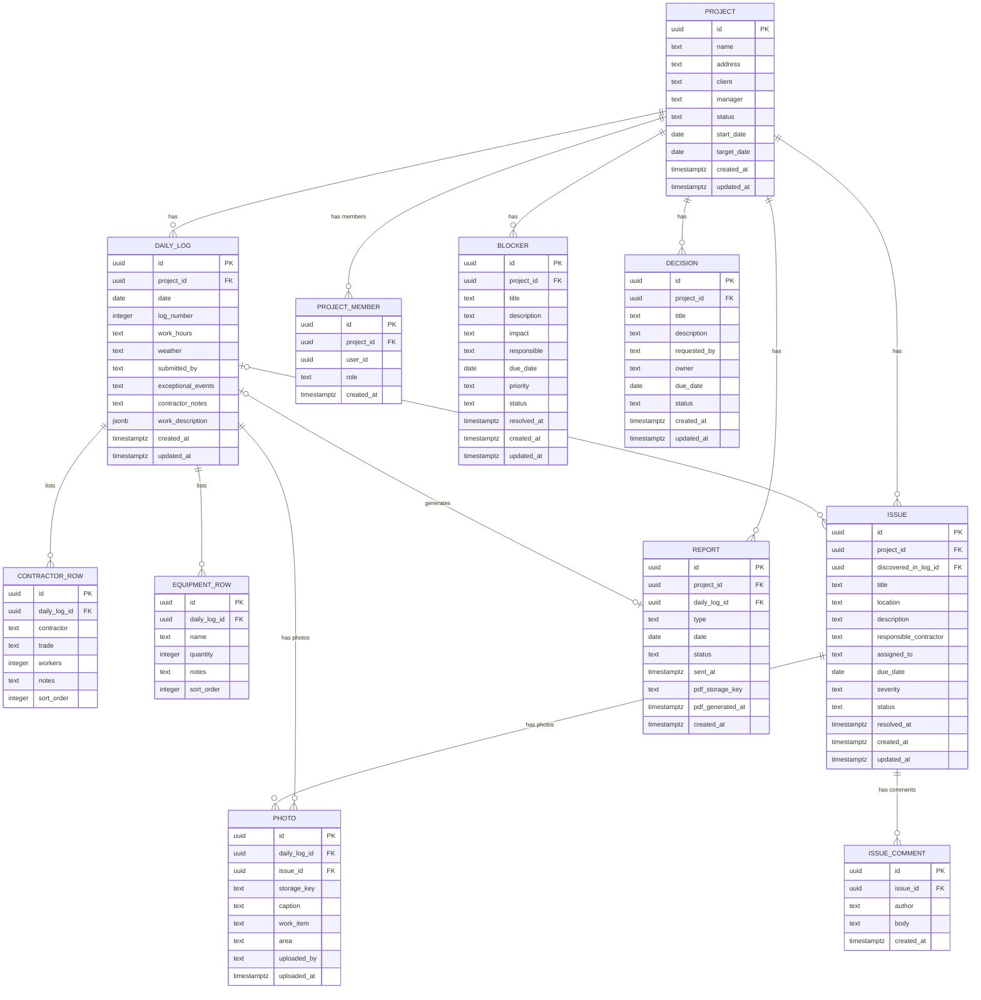

# Entity Relationship Diagram — Mehayesod Platform

> Version 1.1 | 2026-06-15
> Changes from v1.0: RC-01 (photo typed FKs, comment renamed), RC-03 (report uniqueness note), RC-04 (project_member), RA-01 (resolved_at), RA-02 (discovered_in_log_id), RA-05 (log_number)

---

## 1. ERD (Mermaid)



> **RC-01 change:** `PHOTO` and `ISSUE_COMMENT` (formerly `COMMENT`) no longer use a polymorphic
> `entity_type + entity_id` pattern. Both tables now use direct typed FK columns. This enables
> PostgREST auto-joins, DB-level cascade deletes, and RLS authorization paths through the FK.
>
> **RC-04 change:** `PROJECT_MEMBER` added as a new entity for future authentication scoping.

---

## 2. Relationship Explanations

### 2.1 Project → Daily Log (1:many)
Each active Project produces one Daily Log per calendar day. Uniqueness enforced by `UNIQUE (project_id, date)`.

### 2.2 Project → Project Member (1:many)
A project has one or more team members. Each member has a role (`field_manager`, `company_manager`, `admin`, `viewer`). Used for Phase 3 RLS scoping — replaces the JWT `project_ids` claim approach.

### 2.3 Project → Issue (1:many)
Issues are quality defects scoped to a single project.

### 2.4 Project → Blocker (1:many)
Blockers are management-level impediments scoped to a single project.

### 2.5 Project → Decision (1:many)
Management approvals tied to a project context.

### 2.6 Project → Report (1:many)
Reports belong to a project. Metadata-only; content assembled from source daily log at render time.

### 2.7 Daily Log → ContractorRow (1:many)
Ordered list of contractors on site. `sort_order` preserves the paper diary order.

### 2.8 Daily Log → EquipmentRow (1:many)
Ordered list of equipment used. Same ordering convention.

### 2.9 Daily Log → Report (1:0 or 1)
A Daily Log generates at most one daily Report. Enforced by `UNIQUE (daily_log_id)` on the `report` table. `ON DELETE CASCADE` — deleting a log (only possible if report is not `sent`) removes the associated draft/ready report.

### 2.10 Daily Log → Issue (1:many via `discovered_in_log_id`)
An issue may reference the daily log in which it was first observed. Optional, nullable FK. `ON DELETE SET NULL` — the issue persists if the source log is deleted. This enables "issues discovered today" in daily reports.

### 2.11 Daily Log → Photo (1:many via `photo.daily_log_id`)
Photos taken on site are attached to their source log. `ON DELETE CASCADE` — deleting a log removes its photos (after confirming the report is not `sent`).

### 2.12 Issue → Photo (1:many via `photo.issue_id`)
Photos documenting a field defect. `ON DELETE CASCADE` — deleting an issue removes its photos.

### 2.13 Issue → IssueComment (1:many)
Discussion thread on an issue. `ON DELETE CASCADE` — deleting an issue removes its comments.

### 2.14 Photo — Typed FK Constraint
Each photo belongs to exactly one parent entity, enforced by:
```sql
CONSTRAINT photo_exactly_one_parent CHECK (
    (daily_log_id IS NOT NULL)::int +
    (issue_id IS NOT NULL)::int = 1
)
```

---

## 3. Status Enumerations

| Entity | Column | Allowed Values |
|---|---|---|
| project | status | planning, active, on_hold, completed |
| report | status | draft, ready, sent |
| report | type | daily, weekly, monthly |
| issue | status | open, in_progress, resolved, reopened, closed |
| issue | severity | low, medium, high, critical |
| blocker | status | open, in_progress, resolved |
| blocker | priority | low, medium, high, critical |
| decision | status | pending, approved, rejected, deferred |
| project_member | role | field_manager, company_manager, admin, viewer |

---

## 4. Key Indexes

| Table | Index | Purpose |
|---|---|---|
| daily_log | UNIQUE(project_id, date) | One log per project per day |
| daily_log | UNIQUE(project_id, log_number) | Sequential number integrity |
| daily_log | INDEX(project_id, date DESC) | Dashboard and list queries |
| project_member | INDEX(user_id) | "What projects does this user have?" |
| project_member | INDEX(project_id) | "Who is on this project?" |
| project_member | UNIQUE(project_id, user_id) | No duplicate memberships |
| report | UNIQUE(daily_log_id) | One daily report per log |
| report | UNIQUE(project_id, type, date) WHERE type IN ('weekly','monthly') | No duplicate aggregate reports |
| report | INDEX(project_id, date DESC) | Report list queries |
| report | INDEX(project_id, status) | Status-filtered report queries |
| issue | INDEX(project_id, status) | Filtered issue lists |
| issue | PARTIAL INDEX(severity) WHERE status NOT IN ('closed','resolved') | Executive dashboard critical issues |
| issue | PARTIAL INDEX(due_date) WHERE due_date IS NOT NULL | Overdue issue detection |
| issue | PARTIAL INDEX(discovered_in_log_id) WHERE NOT NULL | Issues-per-log lookup |
| photo | PARTIAL INDEX(daily_log_id) WHERE NOT NULL | Log photo retrieval |
| photo | PARTIAL INDEX(issue_id) WHERE NOT NULL | Issue photo retrieval |
| photo | UNIQUE(storage_key) | Duplicate upload prevention |
| issue_comment | INDEX(issue_id, created_at) | Ordered comment thread |
| blocker | INDEX(project_id, status) | Filtered blocker lists |
| blocker | PARTIAL INDEX(priority, status) WHERE critical AND not resolved | Executive dashboard |
| decision | INDEX(project_id, status) | Pending decision queries |
| decision | PARTIAL INDEX(due_date) WHERE status = 'pending' | Overdue decision detection |
| contractor_row | INDEX(daily_log_id, sort_order) | Ordered contractor list |
| equipment_row | INDEX(daily_log_id, sort_order) | Ordered equipment list |

---

## 5. Data Integrity Rules

| Rule | Enforcement |
|---|---|
| One log per (project, date) | UNIQUE index on daily_log |
| Log date not in the future | CHECK constraint: date <= CURRENT_DATE |
| Sequential log number per project | BEFORE INSERT trigger; UNIQUE(project_id, log_number) as backstop |
| project target_date >= start_date | CHECK constraint on project |
| contractor workers >= 1 | CHECK constraint on contractor_row |
| One daily Report per DailyLog | UNIQUE index on report(daily_log_id) |
| No duplicate weekly/monthly reports | PARTIAL UNIQUE index on report(project_id, type, date) |
| Photo belongs to exactly one parent | CHECK constraint on photo |
| Photo references valid entity | FK constraint (daily_log_id or issue_id) |
| Cascade: log deleted → draft/ready report deleted | ON DELETE CASCADE on report.daily_log_id |
| Sent report cannot have its log deleted | BEFORE DELETE trigger on daily_log |
| Sent report cannot have its log edited | BEFORE UPDATE trigger on daily_log |
| Cascade: log deleted → photos deleted | ON DELETE CASCADE on photo.daily_log_id |
| Cascade: issue deleted → photos and comments deleted | ON DELETE CASCADE on photo.issue_id and issue_comment.issue_id |
| resolved_at set on first resolution | BEFORE UPDATE trigger on issue and blocker |
| Status transitions are valid | Application layer state machine |
