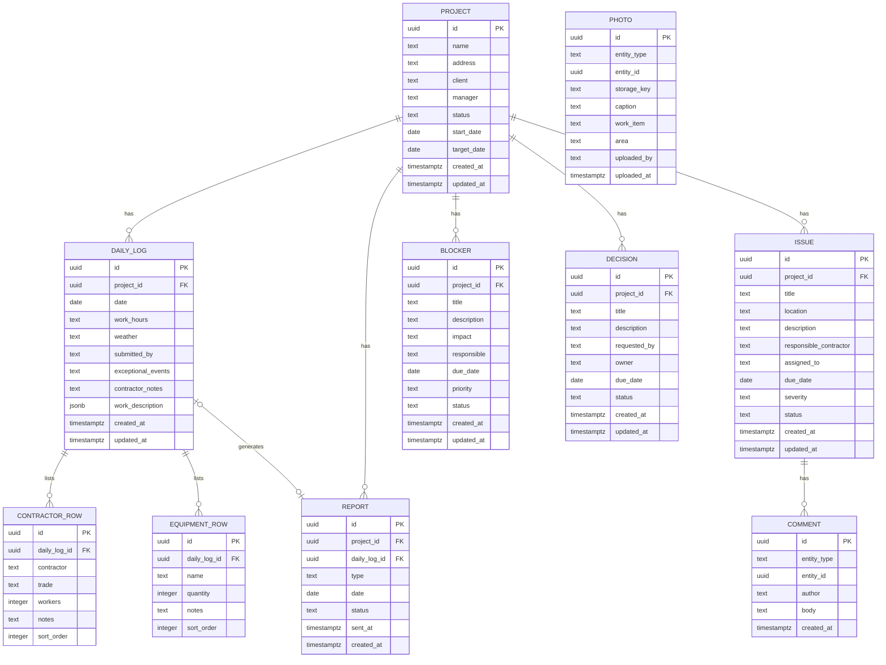

# Entity Relationship Diagram — Mehayesod Platform

> Version 1.0 | 2026-06-14

---

## 1. ERD (Mermaid)

> **Note on polymorphic relationships:** `PHOTO` and `COMMENT` use a polymorphic pattern
> (`entity_type` + `entity_id`) rather than foreign keys. This avoids multiple nullable FK columns
> and makes adding new attachable entities straightforward. The trade-off is that database-level FK
> constraints cannot be enforced directly — application and RLS policies must enforce integrity.

---

## 2. Relationship Explanations

### 2.1 Project → Daily Log (1:many)

Each Project has zero or more Daily Logs. In practice, an `active` project should have one log per calendar day. The uniqueness of (project_id, date) is enforced by a unique index.

### 2.2 Project → Issue (1:many)

Issues are scoped to a single project. An issue cannot belong to multiple projects. Cross-project issues do not exist in this domain.

### 2.3 Project → Blocker (1:many)

Blockers are project-scoped impediments. Same scoping rule as Issues.

### 2.4 Project → Decision (1:many)

Decisions are management approvals tied to a specific project context.

### 2.5 Project → Report (1:many)

Reports belong to a project. The Report table stores metadata only; content is assembled from the source Daily Log at render time.

### 2.6 Daily Log → ContractorRow (1:many)

Each daily log contains multiple contractor entries. `sort_order` preserves the order in which contractors appear in the log (matches the original paper diary format).

### 2.7 Daily Log → EquipmentRow (1:many)

Same as ContractorRow. `sort_order` preserves user-defined sequence.

### 2.8 Daily Log → Report (1:0 or 1)

A Daily Log may or may not have an associated Report. After the field manager triggers generation, a Report record is created with status `draft`. The unique constraint on `daily_log_id` in the `report` table ensures only one daily Report exists per log.

### 2.9 Photo (polymorphic — Daily Log and Issue)

Photos can be attached to:
- `daily_log` entities
- `issue` entities
- (future) `decision` entities

The `entity_type` column acts as a discriminator. Queries filter by `entity_type = 'daily_log' AND entity_id = <log_id>` to retrieve photos for a given log.

### 2.10 Comment (polymorphic — Issue)

Comments currently attach only to Issues but the polymorphic design allows them to be extended to Decisions or Blockers in Phase 2 without schema changes.

---

## 3. Status Enumerations

Rather than enum types (which are hard to migrate), all status columns use `text` with check constraints.

| Entity | Column | Allowed Values |
|---|---|---|
| project | status | planning, active, on_hold, completed |
| daily_log | (none — implicit: submitted) | — |
| report | status | draft, ready, sent |
| report | type | daily, weekly, monthly |
| issue | status | open, in_progress, resolved, reopened, closed |
| issue | severity | low, medium, high, critical |
| blocker | status | open, in_progress, resolved |
| blocker | priority | low, medium, high, critical |
| decision | status | pending, approved, rejected, deferred |
| photo | entity_type | daily_log, issue, decision |
| comment | entity_type | issue, blocker, decision |

---

## 4. Key Indexes (Summary)

| Table | Index | Purpose |
|---|---|---|
| daily_log | UNIQUE(project_id, date) | One log per project per day |
| report | UNIQUE(daily_log_id) | One report per log |
| report | INDEX(project_id, date DESC) | Dashboard queries |
| issue | INDEX(project_id, status, severity) | Filtered issue lists |
| blocker | INDEX(project_id, status, priority) | Filtered blocker lists |
| decision | INDEX(project_id, status) | Pending decision lists |
| photo | INDEX(entity_type, entity_id) | Photo retrieval by parent |
| comment | INDEX(entity_type, entity_id) | Comment retrieval by parent |
| contractor_row | INDEX(daily_log_id, sort_order) | Ordered contractor list |
| equipment_row | INDEX(daily_log_id, sort_order) | Ordered equipment list |

---

## 5. Data Integrity Rules

| Rule | Enforcement |
|---|---|
| One log per (project, date) | UNIQUE index |
| One daily Report per DailyLog | UNIQUE index on daily_log_id |
| Report.project_id == Report.DailyLog.project_id | Application layer + trigger |
| Photo references valid entity | Application layer (polymorphic) |
| Comment references valid entity | Application layer (polymorphic) |
| Status transitions are valid | Application layer state machine |
| Log date not in the future | Check constraint: date <= CURRENT_DATE |
| Report.sent_at set only when status = sent | Application layer |
